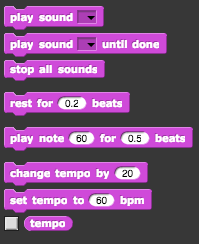

# Make a sprite sing!

For your first project, [**start with this project**](http://snap.berkeley.edu/snapsource/snap.html#present:Username=tealsintro&ProjectName=Make%20a%20Sprite%20sing) to make a quick song! You will find the following blocks in the sound palette useful; feel free to change the default numbers as you see fit:

While you are working on it, try to figure out how to connect and disconnect blocks, and how to remove a piece from inside a long script. You can also try to figure out how to add more sounds.