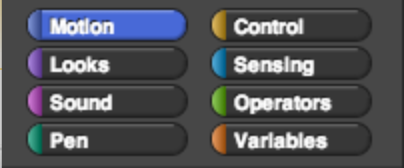

# Some basic Snap! lingo

As we explore Snap! and as we learn new ideas in computer science, you will be seeing words and terms that you may not understand. Below, we show some terms that we will use for the items in Snap!. Keep thinking of more as the class continues!

## Snap! Lingo
| Term| Picture |
| -- | -- |
| **Block Palettes** (or block tabs)	 |  |
| 0:3 | 1:3 |
| 0:4 | 1:4 |
| 0:5 | 1:5 |
| 0:6 | 1:6 |
| 0:7 | 1:7 |
